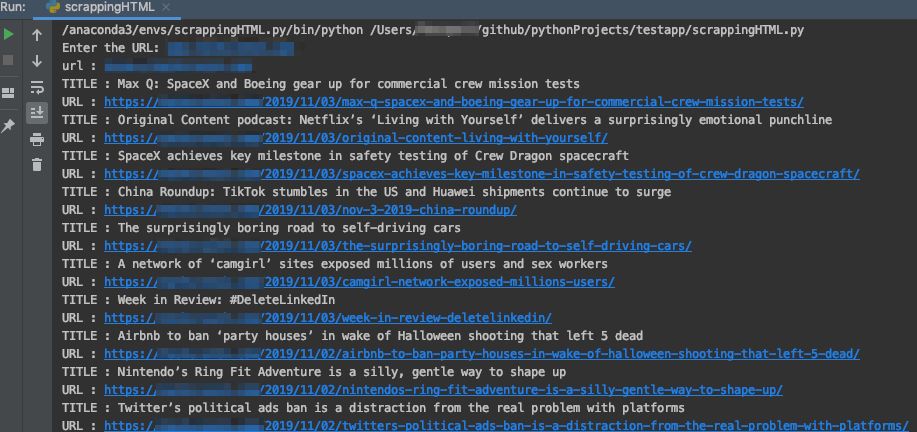

# Web Scraping HTML

I have anaconda 3 installed and running pycharm CE. 

Once you have those installed. When you execute the code in the pycharm terminal, you will get a prompt to input the website. This code for now is only really meant to be executed against 1 website, as this is one of my favorite websites to check on the latest tech news. 

## Mission of this project:
* Understand how to install anaconda 3 and how to get this running locally. 
* Install Pycharm CE IDE.
* Also trying to get an understanding of how [BeautifulSoup](https://www.crummy.com/software/BeautifulSoup/bs4/doc/) works.

## Screenshot

